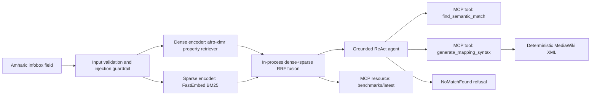
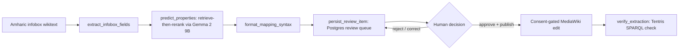

# Cross-Lingual Knowledge Engineering Assistant

Amharic-to-English DBpedia ontology mapping via hybrid RAG and MCP tools.

## Domain

This project targets cross-lingual semantic web engineering for Amharic Wikipedia
infobox to English DBpedia ontology mapping. Editors currently spend substantial
time guessing technical ontology property names, while generic translation tools
miss schema-specific terms and acronym-heavy fields such as IATA or ICAO codes.

Retrieval-augmented generation is required because DBpedia ontology properties
are domain-specific, strictly typed, and too schema-sensitive for an LLM to
memorize safely. MCP tools are required so deterministic code, not an LLM,
generates MediaWiki XML and exposes live benchmark resources.

## Architecture



The implemented flow is: Amharic query -> sanitizer -> dense/sparse encoders ->
in-process hybrid search over the real DBpedia ontology corpus -> grounded
ReAct agent -> MCP tools -> deterministic XML or explicit refusal. Dense
retrieval uses `dice-research/amharic-property-retriever-afro-xlmr-base`
locally on CPU by default; sparse retrieval uses FastEmbed's `Qdrant/bm25`
for exact acronym and alias rescue. The corpus is the real DBpedia ontology
(~2,948 properties), merged with aliases from `Mapping_am.xml` and the
legacy `data/*.md` demo corpus, embedded once per process and ranked with
reciprocal rank fusion — no external vector database. Structured JSON logs
carry a correlation ID across MCP, RAG, and agent layers.

### The pipeline surface (frontend, review queue, publish)

The MCP tools above are one way in. The other is a full paste-an-infobox
workflow, aimed at human reviewers rather than an MCP client:



`mcp_server/pipeline.py` runs this as a 4-node LangGraph graph (a sequential
fallback runs the same nodes if `langgraph` isn't installed) and streams each
node's progress over `POST /v1/preview` (SSE) on a separate Starlette app,
`mcp_server/http_app.py`. The SvelteKit frontend in `frontend/` is the
reviewer-facing client: a Mapping Assistant page that pastes wikitext and
watches the pipeline stream live, and a Review Queue page that lists
`pending_review` rows and records approve/reject/correct decisions — every
decision is logged as DSPy training data (`rag/training_log.py`) regardless
of outcome. Publishing a mapping back to `mappings.dbpedia.org` is a real,
outward-facing MediaWiki edit and is never automatic: it requires the
reviewer's explicit `publish: true` on the decision call, gated by
`mcp_server/consent.py::require_consent`. `mcp_server/qa.py::verify_extraction`
closes the loop by loading a `.nt` extraction file into a throwaway
Tentris container and checking the published triple actually appears.

## Development

```bash
just test
just lint
just test-integration
just test-e2e
just test-perf
just validate-corpus
```

Integration and e2e tests download the real dense/sparse models on first run
(network required) — no external service needs to be started first.

### Running the pipeline surface

```bash
docker compose up -d postgres   # or leave DATABASE_URL unset for local SQLite
just run-http                   # POST /v1/preview, /v1/find-semantic-match, /v1/reviews...
cd frontend && pnpm install && pnpm run dev --open
```

The frontend defaults to `http://localhost:8001` for `just run-http`
(`PUBLIC_CROSS_LINGUAL_URL` in `frontend/.env`) — see `frontend/README.md`
for the full endpoint-to-screen mapping. Retrieve-then-rerank prediction
(`rag/predict.py`) additionally wants a local Ollama server serving
`gemma2:9b`; without one, predictions still work off retrieval alone
(`used_llm: false` in the response) rather than failing.

## Claude Desktop

Generate an MCP configuration block for this checkout:

```bash
uv run python scripts/print_desktop_config.py
```

Keep `GROQ_API_KEY` in the ignored project `.env`; do not copy credentials
into `claude_desktop_config.json`. Paste the
generated credential-free block into the desktop config and restart Claude
Desktop. The generated command changes to the project directory before startup,
pins Python 3.11 for MCP compatibility, installs only frozen runtime
dependencies, and lets Pydantic load the intended `.env`. The server exposes
`find_semantic_match`, `generate_mapping_syntax`, and
`resources://benchmarks/latest`.

## Evaluation

- Golden query set: `evaluation/test_queries.json`
- Precision harness: `evaluation/run_precision_eval.py`
- Retrieval metrics: Precision@1 and Hits@3 over the 8 positive golden queries
- Relevance harness: `evaluation/run_relevance_eval.py`
- Manual 1-5 review evidence: `evaluation/human_overrides.csv`
- Generated report: `evaluation/results.md`
- Latency report: `evaluation/latency_report.md`

## Requirements Traceability

| Requirement | Subtask | Proof test |
|---|---:|---|
| Domain selection and README framing | 0.5 | `tests/test_docs.py::test_readme_required_sections_and_domain_language` |
| More than 20 ontology property documents | 1.1 | `tests/test_data_corpus.py::test_minimum_property_count` |
| Real ontology corpus merged with known aliases | 10.1/10.3 | `tests/test_corpus.py::test_build_corpus_enriches_with_published_amharic_mappings` |
| target_class as a soft (non-excluding) ranking hint | 10.3 | `tests/test_retrieval.py::test_search_target_class_breaks_ties_between_equally_ranked_documents` |
| Dense and sparse embedding channels | 2.2/10.2 | `tests/test_retrieval.py::test_encode_query_uses_supplied_shared_embedders` |
| In-process hybrid dense+sparse RRF retrieval | 3.1/10.3 | `tests/test_retrieval.py::test_search_finds_exact_alias_match_via_sparse_channel` |
| Confidence fallback to no match | 3.3 | `tests/test_retrieval.py::test_search_low_score_returns_no_match` |
| Acronym collision mitigation | 3.4 | `tests/integration/test_retrieval_precision.py::test_acronym_collision_sparse_channel_rescues_icao` |
| MCP semantic search tool | 4.2 | `tests/test_mcp_server.py::test_find_semantic_match_happy_path` |
| Deterministic XML generation tool | 4.3 | `tests/test_mcp_server.py::test_generate_mapping_syntax_snapshot` |
| Benchmark MCP resource | 4.4 | `tests/integration/test_mcp_protocol.py::test_mcp_protocol_lists_tools_calls_tool_and_reads_resource` |
| Consent-gated destructive-tool policy | 4.5 | `tests/test_consent.py::test_consent_required_decorator_blocks_until_approved` |
| Prompt template grounding | 5.2 | `tests/test_agent.py::test_prompt_contains_grounding_constraint` |
| Prompt-injection guardrail | 5.3 | `tests/test_agent.py::test_injection_classifier_catches_known_patterns` |
| ReAct trace over MCP tools | 5.4 | `tests/test_agent.py::test_react_trace_shape_happy_path` |
| Claude Desktop config helper | 6.1 | `tests/test_scripts.py::test_print_desktop_config_outputs_valid_json_with_existing_path` |
| Golden query evaluation data | 7.1 | `tests/test_eval_data.py::test_query_set_schema_and_count` |
| Evaluation report determinism | 7.4 | `tests/test_eval_harness.py::test_results_md_generation_is_deterministic` |
| Demo transcripts | 8.1 | `tests/test_docs.py::test_demo_transcripts_cover_required_paths` |
| Structured logs and correlation IDs | 9.1 | `tests/test_observability.py::test_correlation_id_propagates_across_layers` |
| Centralized error taxonomy | 9.2 | `tests/test_error_handling.py::test_mcp_boundary_maps_retrieval_failure_to_client_safe_error` |
| Full e2e pipeline | 9.3 | `tests/e2e/test_full_pipeline.py::test_full_e2e_retrieve_agent_generate_xml` |
| Circuit-breaker degradation | 9.3 | `tests/test_error_handling.py::test_retrieval_circuit_breaker_degrades_after_failure` |
| Latency budgets | 9.4 | `tests/perf/test_latency.py::test_react_happy_path_latency_budget` |
| Final documentation traceability | 9.5 | `tests/test_docs.py::test_traceability_matrix_entries_reference_existing_tests` |
| Infobox extraction node | 16.1 | `tests/test_pipeline.py::test_extract_infobox` |
| LangGraph pipeline: extract → predict → format → persist | 16.2 | `tests/test_pipeline_orchestration.py::test_full_pipeline_end_to_end_produces_a_pending_review_row_with_length_predicted` |
| SSE preview endpoint matching the frontend's contract | 16.3 | `tests/test_http_pipeline_routes.py::test_preview_streams_one_event_per_node_and_a_final_result` |
| Postgres-backed review queue | 14.1 | `tests/test_review_queue.py::test_create_review_item_persists_a_row` |
| Consent-gated MediaWiki publish | 14.3 | `tests/test_publish.py::test_publish_is_refused_without_consent` |
| Decision-to-publish wiring on the review endpoint | 14.3 | `tests/test_review_queue.py::test_decide_review_with_publish_true_publishes_and_refreshes` |
| Post-publish SPARQL verification | 15.1 | `tests/test_qa.py::test_verify_extraction_returns_true_for_a_present_triple` |

## Current Milestone

All of `implementation.md`'s Phase 1 (Milestones 0–9: retrieval, MCP tools,
the Groq agent, evaluation) and Phase 2 (Milestones 10–16: in-process
retrieval replacing Qdrant, retrieve-then-rerank prediction, the Postgres
review queue, consent-gated MediaWiki publish, Tentris-backed post-publish
verification, and the LangGraph pipeline + SvelteKit frontend that ties all
of it together) are implemented. Remaining work is optional extension and
production deployment packaging beyond the roadmap.

## Future Work

- Add multi-query or step-back query transformation as a second advanced RAG
  technique for vague Amharic fields.
- Extend the alias corpus and evaluation set to more Ethiopian and multilingual
  Wikipedia communities beyond Amharic.
- Auto-trigger `agentic-dbpedia`'s DEF extraction (and this repo's
  `verify_extraction` check) after a publish, instead of the current manual
  trigger.
- Real auth on the frontend and HTTP API — deliberately deferred for this
  internal-tool iteration (see `frontend/README.md`).
- Fine-tune the DSPy predictor on the training log `rag/training_log.py`
  accumulates from every review decision, rather than relying on the
  base Gemma 2 9B retrieve-then-rerank prompt indefinitely.
